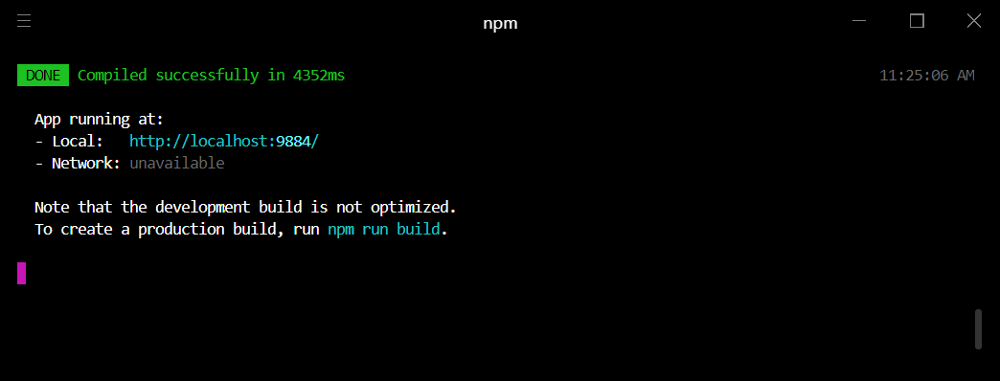
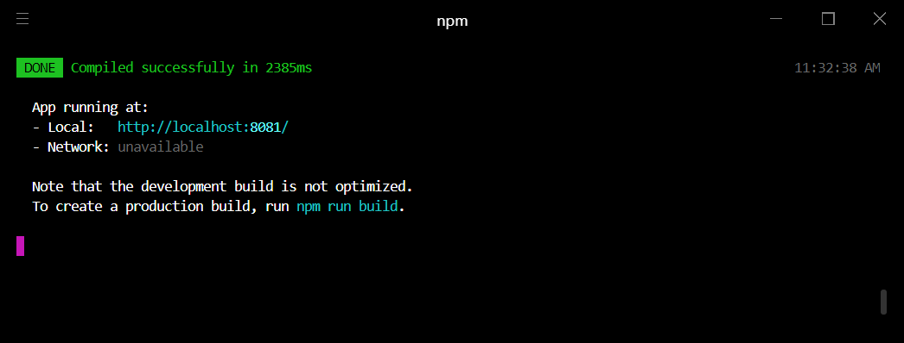
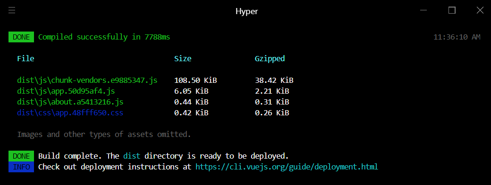
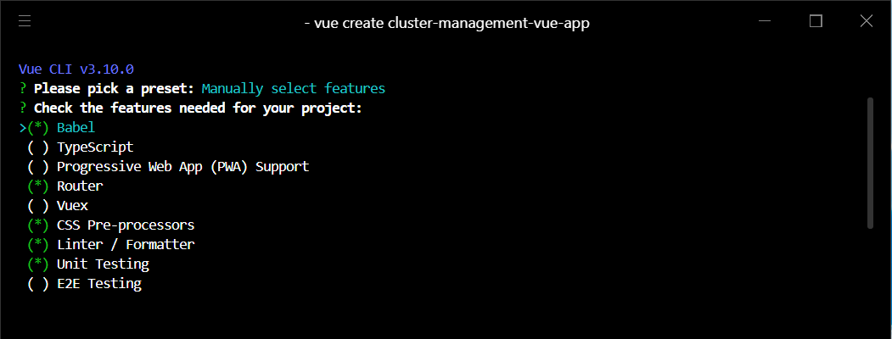
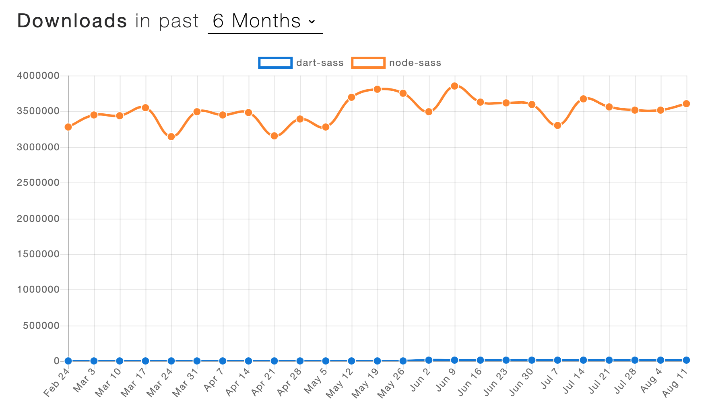
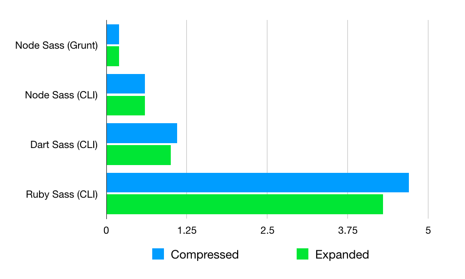

# Vue.js 프론트엔드 개발/배포 라이프사이클 한눈에 보기

## 목표
- Vue CLI3를 통한 Vue 프로젝트 생성 & 개발환경 설정 끝내기
- 프론트엔드 개발에 필요한 개념/용어 익숙해지기

## 목차
1. 설치
   1. 버전정보
   1. NVM 설치
   1. Node/NPM 설치
   1. Vue CLI 설치

1. 프로젝트 생성 및 실행
   1. vue create [프로젝트이름]
   1. npm run serve (vue-cli-service serve)
   1. npm run build (vue-cli-service build)

1. 프로젝트 추가 모듈 설정
   1. Transpiler: Babel
   1. CSS Pre-processor: Sass/SCSS (with node/sass)
   1. Linter: ESLint + Prettier
   1. Unit Testing: Jest

1. Vue 컴포넌트 개발 (Next)
   1. 프로젝트 레이아웃 (Smart-Dummy pattern, Atomic design, BEM 등)
   1. 네이밍 컨벤션 (메서드, 이벤트, 변수 등)
   1. 테스트 범위/수준
   
1. 운영 빌드/배포
   1. Dockerfile

## 설치
### 버전정보
- NVM: 1.1.7
- NODE: 10.16.2
- NPM: 6.9.0
- Vue CLI: 3.10.0

### NVM(Node Version Manager) 설치
필요한 노드 버전이 다를 경우, 이전 버전을 삭제하지 않고도 개발 환경에 따라 여러 노드 버전을 관리할 수 있음

[nvm-setup.zip 다운로드](https://github.com/coreybutler/nvm-windows/releases)
```bash
nvm version
```

### Node/NPM 설치
NVM으로 설치하기
```bash
nvm proxy [ip]
nvm install v10.16.2
nvm ls
# 10.16.2
nvm use 10.16.2
# Now using node v10.16.2 (64-bit)
node --version
# v10.16.2
npm --version
# 6.9.0
# node/npm 설치 경로: \AppData\Roaming\nvm
```

NPM 프록시 설정 (전역)
```bash
npm config set proxy [ip] --global
npm config set https-proxy [ip] --global
npm config set strict-ssl false --global
npm config get proxy
npm config get https-proxy
npm config get strict-ssl
npm config ls -l
```

### Vue CLI 3 설치 
Vue CLI로 프로젝트를 생성하면 Vue에서 Webpack, Babel, Jest 등 기본 설정 파일을 제공하기 때문에 초기 설정에 드는 시간을 줄일 수 있음

```bash
npm install -g @vue/cli
vue --version
# 3.10.0
```

CLI 미리보기
- vue create
  - 새로운 Vue 프로젝트 빠르게 생성, 다양한 preset/plugin 선택 가능
- vue ui
  - 프로젝트 설정을 GUI로 제공
- vue-cli-service serve
  - 개발용 웹서버를 직접 띄울 필요없이 webpack-dev-server를 이용해 웹서버를 자동 실행
  - webpack-dev-server는 Hot-Module-Replacement(HMR) 기능 제공
- vue-cli-service build
  - webpack을 이용하여 배포에 필요한 파일(번들, bundle)을 dist/ 디렉토리에 생성
  - 번들링: webpack은 js, css 파일을 번들링하여 하나의 파일을 생성함
- vue-cli-service inspect
  - Vue CLI 3은 webpack.config.js 설정 파일을 외부로 노출시키지 않음
  - Vue CLI 프로젝트에서 제공하는 webpack 설정 확인


## 프로젝트 생성 및 실행
### vue create 
```bash
vue create hello-world
```
package.json (default)
```json
"scripts": {
    "serve": "vue-cli-service serve",
    "build": "vue-cli-service build"
}
```

### npm run serve
개발용 웹서버로 webpack-dev-server를 실행, 메모리에 올려두고 파일이 변경되었을 때 자동 reload하기 때문에 개발 시간 단축



vue.config.js - webpack-dev-server 실행 포트 지정하기
```
module.exports = {
  devServer: {
    port: 8081
  }
}
```


### npm run build
dist/ 디렉토리에 webpack 번들링 결과물 저장, 운영 배포시 활용



### 개발 환경별 서버 설정
테스트하고자 하는 개발 서버 주소 변경의 번거로움을 줄이기 위해서 `개발 환경별로 환경변수 파일`을 관리한다. 그리고 `실행 script`를 만들어 두면 간편하게 개발 서버를 변경할 수 있다.

**환경변수 관리**

.env.local - 프론트엔드, 백엔드 모두 변경되는 상황
``` 
VUE_APP_API_SERVER=http://localhost:8080
```

.env.development - 프론트엔드만 변경되는 상황
```
VUE_APP_API_SERVER=http://localhost:4000
```

**script 작성**

package.json
```text
"scripts": {
    "serve": "vue-cli-service serve --mode local",
    "serve:dev: "vue-cli-service serve --mode development"
}
```

**실행**

npm run serve (로컬 백엔드 API 서버 호출)
```
.env
.env.local
```

npm run serve:dev (개발계 백엔드 API 서버 호출)
```
.env
.env.development
```

**devServer 설정**

백엔드 서버로 API 요청을 보내기 위해서는 webpack-dev-server에 proxy 설정이 필요

```javascript
// GET /api/employees
module.exports = {
  devServer: {
    proxy: {
      '^/api': {
        target: process.env.VUE_APP_API_SERVER,
        changeOrigin: true
      }
    }
  }
}
```


### Webstorm 설정
.vue 확장자 파일 인식을 위한 Webstorm plugin 설치
```
File > Settings > Plugins > Vue.js
```


## 프로젝트 추가 모듈 설치/설정

### Javascript compiler: Babel
브라우저나 개발 환경에 따라 지원하는 자바스크립트 스펙이 다를 수 있다. 개발자는 최신 자바스크립트 스펙(ES6+)으로 개발하고 Babel의 도움을 얻어 각 환경에 맞는 코드로 변환한다.

```js
// Babel Input: ES2015 arrow function
[1, 2, 3].map((n) => n + 1);

// Babel Output: ES5 equivalent
[1, 2, 3].map(function(n) {
  return n + 1;
});
```
babel.config.js
```js
module.exports = {
  presets: ["@vue/app"]
};
```

### CSS Pre-processors: Sass/SCSS (with node-sass)

CSS 재사용, 유지보수성, 확장성을 위한 툴, CSS를 읽기 쉽고 구조화할 수 있게 도와줌

**기존 CSS 관리의 불편함**

- CSS 이름 충돌
- 어려운 디버깅
- 어려운 CSS 재사용
- 브라우저별 지원하는 CSS 속성이 다름

그래서 우리는
- CSS 모듈화(여러 파일로 나눔) 해서 가독성을 높이고
- CSS 공통 속성은 변수 선언을 통해 중복 제거
- CSS 중첩, DOM 구조에 맞게 CSS도 구조화

할 것이다.

**그런데...**

기존 CSS 문법이 아닌 문법을 이용해서 CSS를 작성하면 브라우저는 이해할 수 없기 때문에 CSS 전처리기를 이용해서 브라우저가 알고 있는 CSS 파일로 컴파일해야 한다.

Sass를 이용하면 .scss 확장자 파일로 CSS를 작성한다.

**CSS 전처리기 종류** - Sass, Less, Stylus

Sass를 선택한 이유: 가장 오래됨, 가장 많이 사용, 많은 커뮤니티, Syntax가 눈으로 읽기에 더 명확

**CSS Pre-processors 기능**

- Variables: Primary 색상, 기본 폰트 크기 등과 같이 어플리케이션 전반에 걸쳐 사용되는 CSS 값을 변수로 선언하고 재사용할 수 있다.

CSS
```css
div {
    font-size: 16px;
}
```
Sass/SCSS
```scss
$font-size: 16px; // font-size 변수 선언/값 할당

div {
    font-size: $font-size;
}
```

- Nesting: 기존 CSS 문법으로는 HTML 부모/자식 요소에 스타일을 적용하기 위해서 셀렉터들의 조합으로 DOM 구조를 표현해야 했다. CSS를 중첩 구조로 표현할 수 있어 스타일 구조의 가독성을 높일 수 있다. 중첩이 너무 깊어지지 않도록 조심한다.

CSS
```css
ul { margin: 0; }
ul li { float: left; }
ul a { color: #999; }
ul a:hover { color: #229ed3; }
```
Sass/SCSS
```scss
$link-color: #999;
$link-hover: #229ed3;

ul {
    margin: 0;

    li {
        float: left;
    }

    a {
        color: $link-color;

        &:hover {
            color: $link-hover;
        }
    }
}
```

- Mixins: CSS 속성값을 파라미터로 받아서 스타일을 적용하는 방법을 제공한다. CSS 코드 중복을 줄일 수 있고 스타일 변경에 유연성을 제공한다.

CSS
```css
h1 { border: 5px solid #ddd; }
h1:hover { border-color: #999; }
```
Sass/SCSS
```scss
@mixin bordered($width) {
    border: $width solid #ddd;

    &:hover {
        border-color: #999;
    }
}

h1 {
    @include bordered(5px);
}
```

- Extends: 공통 스타일을 한 번 정의해두고 필요한 코드 블럭에서 가져다 쓸 수 있다. 코드 중복을 줄이고 가독성을 높인다.

CSS
```css
.block, p, ul, ol { margin: 10px 5px; }

p { border: 1px solid #eee; }
ul, ol { color: #333; text-transform: uppercase; }
```
Sass/SCSS
```scss
.block { margin: 10px 5px; }

p {
  @extend .block;
  border: 1px solid #eee;
}

ul, ol {
  @extend .block;
  color: #333;
  text-transform: uppercase;
}
```

**node-sass vs. dart-sass**

사용률


컴파일 속도
[](https://davidgracieweb.co.uk/node-sass-vs-grunt-sass-vs-dart-sass-vs-ruby-sass/)

### Linter: ESLint (+ Prettier)
ECMAScript/Javascript 표준에 맞게 코드 품질을 높일 수 있도록 ESLint를 적용한다. 

기본으로 설정된 Linting 규칙을 팀 코드 컨벤션에 맞게 변경할 수 있다.

Prettier를 함께 사용하면 서로 다른 팀원들의 코딩 스타일을 일련의 규칙에 맞게 포맷팅 할 수 있어 일관된 코딩 스타일 적용이 가능하다.

Dependencies
```npm
eslint
prettier
eslint-config-prettier: eslint와 prettier 규칙 중 충돌나는 것을 비활성화 
eslint-plugin-prettier: prettier에서 정의한 규칙을 eslint에 추가하기 위한 모듈, lint 돌렸을 때 오류를 함께 출력
```

.eslintrc.js

```js
module.exports = {
  extends: ["plugin:vue/essential", "@vue/prettier"], // 적용하고자 하는 rule 선언, eslint 룰에 추가 
  rules: { // 규칙 변경
    "no-console": process.env.NODE_ENV === "production" ? "error" : "off",
    "no-debugger": process.env.NODE_ENV === "production" ? "error" : "off",
    //  "semi": ["error", "always"], // ;을 항상 붙여야 한다.
     // "quotes": ["error", "double"],
        // "quotes": ["error", "single"], // '으로 감싸야 한다. "은 안된다.
  }
}
```
https://eslint.org/docs/rules/
https://eslint.org/docs/user-guide/getting-started

.prettierrc

IDE 소스 포맷팅 단축키/메뉴를 통해 `일관된 코딩 스타일` 적용 가능, 정의한 코드 규칙대로 포맷팅
```
{
  "printWidth": 100,
  "tabWidth": 2,
  "singleQuote": true, **
  "trailingComma": "all",
  "bracketSpacing": true,
  "semi": true,
  "useTabs": false,
  "arrowParens": "avoid",
  "endOfLine": "lf"
}
```
https://prettier.io/docs/en/configuration.html

**Webstorm 설정**

Settings > Languages & Frameworks > Javascript > Libraries > Download > eslint, prettier

**실행**

막 자기 스타일로 개발하고 Webstorm 포맷팅 단축키(Ctrl + Alt + Shift + P)/우클릭 Reformat with Prettier로 포맷팅하고 IDE가 잡아주는 eslint/prettier 에러 수정


ESLint은 코드품질, Prettier는 코드포맷, 본래 목적은 약간 다르지만 각자 코딩 규칙을 정의하고 있기 때문에 양쪽 규칙이 다를 수 있다.

양쪽에 있는 디폴트 코드 규칙이 충돌하지 않으려면 설정이 필요함 (.eslintrc.js, .prettier)

IDE 기본 포맷팅 룰과 ESLint/Prettier 다른 경우는 맞춰줘야 함 (i.e. indent, 한줄에 글자 수 등)

**Prettier 더 편하게 실행**
파일 저장(ctrl+s)할 때 자동으로 Reformat with Prettier 하는 방법 > https://prettier.io/docs/en/webstorm.html 

### Unit tesing: Jest
테스트 코드를 작성 했을 때 얻을 수 있는 이점은, 리팩토링 이후/코드 추가/변경 후 기존 코드가 제대로 작동하고 있는 것을 검증하기 매우 간편하다.

그리고 새로운 팀원이 들어왔을 때 기능을 파악하기 수월하다.

TDD를 하든 나중에 코드 검증을 위한 테스트 코드를 짜든 중요한건 테스트 가능한 코드를 짜는 것이다.
테스트 가능한 코드란 function 단위로 잘 쪼개놓은, 클린 코드
테스트 코드 짜기가 힘들면 코드를 제대로 구조화하지 못했다라고 볼 수 있음. -> 리팩토링 하면됨

Unit Test는 주어진 input에 따라 설계한 output이 잘 나오는지 테스트 하는 것, 세부 구현 로직을 테스트하지 않고 인터페이스를 테스트하는 것

**Unit Testing 툴**
- mocha(runner, 테스트 구문 작성을 위한 구조만 제공), chai(assertion library)
- Jest

**Webstorm 설정**

Settings > Languages & Frameworks > Javascript > Libraries > Download > eslint, prettier

### Bundler: Webpack

**Webstorm 설정 (Vue CLI3)**

Settings > Languages & Frameworks > Javascript > Webpack > [Project Root]\node_modules\@vue\cli-service\webpack.config.js

**webpack 설정 확인**
```bash
vue inspect > output.js
```

# 프로젝트 개발

## 필요 기술
- Vue.js
- Jest (Unit tesing)
- +알파...

## 코드 커뮤니케이션
- 프로젝트 레이아웃 (Smart-Dummy pattern, Atomic design, BEM 등)
- 네이밍 컨벤션 (메서드, 이벤트, 변수 등)
- 테스트 범위/수준 (무엇을 테스트할 것인가?)

이 모든 것은 팀의 결정에 달려있음, 어느정도 틀을 정해놓을 것임


# 프로젝트 배포

## Dockerfile (예시)
```
FROM node:lts-alpine as build-stage
RUN mkdir -p /usr/app/client
WORKDIR /usr/app/client
COPY package*.json ./
RUN npm install
COPY . .
RUN npm run build

FROM nginx:stable-alpine as production-stage
RUN mkdir -p /var/log/nginx
RUN mkdir -p /var/www/html
COPY nginx/nginx.conf /etc/nginx/nginx.conf
COPY nginx/conf.d/default.conf /etc/nginx/conf.d/default.conf
COPY --from=build-stage /usr/app/client/dist /var/www/html
RUN chown nginx:nginx /var/www/html
EXPOSE 80
CMD ["nginx", "-g", "daemon off;"]
```


# Next TODO
- Vue, Jest 익숙해지기
- 프로젝트 레이아웃 (Smart-Dummy pattern, Atomic design, BEM 등)
- 네이밍 컨벤션 (메서드, 이벤트, 변수 등 - Pascal, prefix, ..)
- 테스트 범위/수준 (무엇을 테스트할 것인가? - render, interaction(event), lifecycle)
- 슬랙 채널 devops-frontend